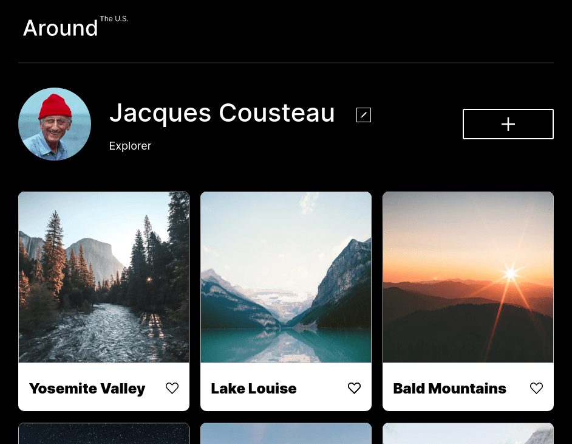
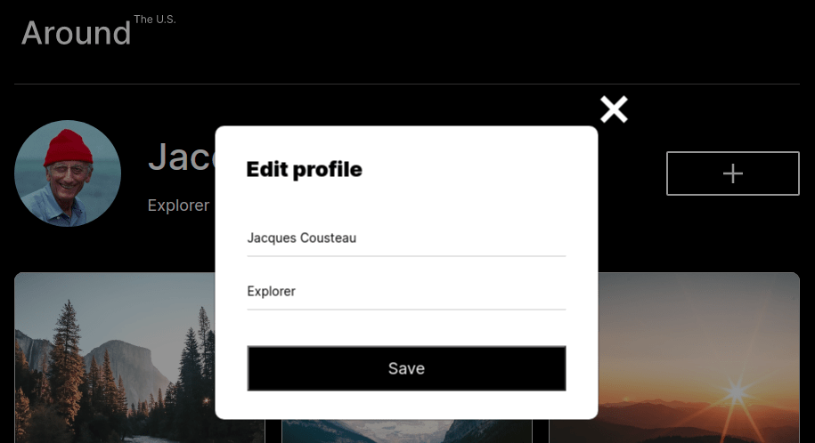

# Yandex / Practicum Project 4
## Project 4: Around The U.S.

### **Overview**

This is a single page project title *Around The U.S.* The page is an interactive page where users can add, remove or like photos, while also updating their profile information.

### Technologies/Languages Used
* Figma
* Terminal/Command line
* HTML
* CSS
* Responsive design
* BEM class naming conventions
* BEM file structure organization
* CSS Flexbox property
* CSS Grid property 
* CSS transition property
* JavaScript

**Github Pages Link**

[exmelendez.github.io/web_project_4](https://exmelendez.github.io/web_project_4/)

**Sample Image**

